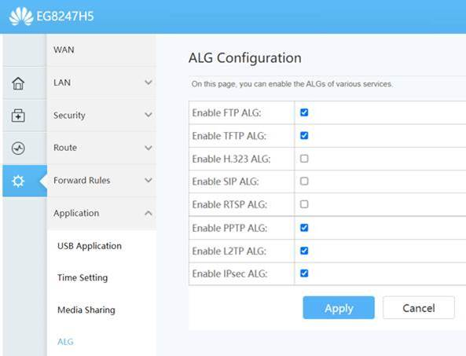

# VOIP

<h1 align="center"> Summary </h1>

- Account Active ?
- Physical Layer (Historical Alarms, Powers) ?
- Connect Package ?
- PTA Whitelisting Certificate ?
- Link Choking ?
- Change ONT settings (see below)
- WINMTR Result ?

---

When any call center customer reports issue in calls, please make sure to perform the following steps:

- Never forget ONT alarms, in case of Low Optical Power or syncing issue on the LAN ports issues can be faced as well

- Confirm IP Whitelisting expiry date, if it has passed or customer hasn’t gotten the IP whitelisted, refuse to TS further politely

- In case IP is whitelisted with expiry date in future, ask customer for WinMTR AND TCP Traces on the port on which their remote server is listening on (Google how to do both)

- In case the dialing device is Huawei ONT, make sure the following settings are UNCHECKED:

- In case the dialing device is Mikrotik, get the SIP ports enabled from Core TAC or yourself.

- In case the dialing device is any external router or firewall, ask customer to ensure that the ports traffic is not getting blocked on it.

- See link utilization on call and if the link is choking, convey the customer.

- Take the WinMTR of the destination from your own PC as well, if there is a difference between both i.e. the traces at your end have lower ms than the customer, forward to **Core** for optimization

- Look closely on the 1st two hops of the WinMTR, if loss is observed at LAN side there is probable link choking or issue in customer’s LAN side.